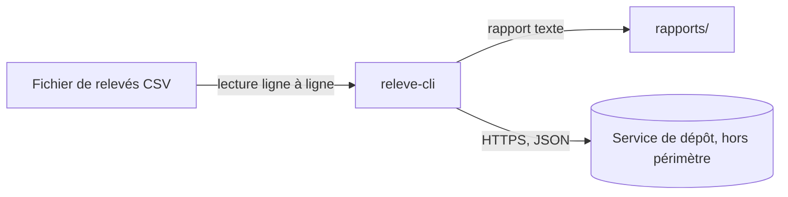

# Schéma d'architecture de releve-cli

Date de validité : 6 octobre 2026

## Architecture

## Légende

- Rectangle : élément du système pouvant être remplacé indépendamment.
- Cylindre : service ou système externe.
- Flèche : circulation d'une information.
- Chaque flèche indique le moyen utilisé, le sens et les données transmises.

## Périmètre

Le schéma couvre la lecture des fichiers CSV, le traitement par `releve-cli`, la génération des rapports et l'envoi vers le service de dépôt.

Hors périmètre : l'implémentation interne du service de dépôt, son stockage et son infrastructure réseau.

## Date de validité

État de l'architecture constaté le 6 octobre 2026.

